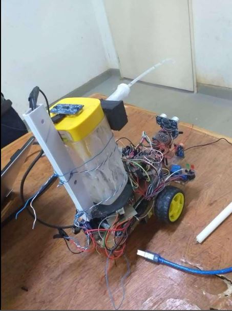

<div align="center">


[](https://git.io/typing-svg)

<br/>


</div>

---

## 🔥 Project Overview

> *"Inspired by the **Rusumo Border fire accident** — The New Times, August 21, 2018 — a tragedy that exposed emergency responders to life-threatening conditions."*

Fire accidents strike without warning and routinely force firefighters into deadly environments. This project answers that challenge with an **autonomous robotic system** that detects, responds to, and suppresses fires — without putting a single human life at risk.



The robot uses a **NodeMCU (ESP8266)** paired with flame sensors to detect fire and immediately activate a water pump for suppression, while simultaneously publishing live status data to an **IoT monitoring dashboard** for remote situational awareness.

---

## 🎯 What This System Solves

| Problem | Solution |
|---|---|
| ⚠️ Firefighters entering dangerous zones | 🤖 Autonomous robot handles first response |
| ⏱️ Slow emergency reaction time | ⚡ Instant sensor-triggered suppression |
| 👁️ No remote situational awareness | 📊 Live IoT dashboard with real-time data |
| 🔔 No early warning system | 🚨 Automated fire alerts on detection |

---

## 🏗️ System Architecture

```
┌─────────────────────────────────────────────────────────────┐
│                  SMART FIRE FIGHTING ROBOT                  │
├─────────────┬──────────────┬──────────────┬─────────────────┤
│  DETECTION  │   CONTROL    │  ACTUATION   │   MONITORING    │
│             │              │              │                 │
│ 🔥 Flame    │ NodeMCU      │ 💧 Water     │ 📡 MQTT Broker  │
│   Sensors   │ ESP8266      │   Pump       │                 │
│             │              │              │ 📊 IoT Dashboard│
│ 💧 Water    │ Fire Logic   │ ⚙️  DC Motors │   (Blynk /     │
│   Level     │ Algorithm    │   + Driver   │   ThingSpeak)   │
│   Sensor    │              │              │                 │
│             │              │ 🚨 Alerts    │ 🔔 Push Alerts  │
└─────────────┴──────────────┴──────────────┴─────────────────┘
```

**Data Flow:**
```
Flame Sensors → NodeMCU Controller → Fire Detection Logic
      ↓                                       ↓
Water Level Sensor              Water Pump Activation
      ↓                                       ↓
      └──────────→ IoT Platform ←─────────────┘
                       ↓
              Remote Dashboard + Alerts
```

---

## ✨ Key Features

<table>
<tr>
<td width="50%">

### 🔍 Automatic Fire Detection
Flame sensors continuously scan the environment. The moment fire is detected, the system triggers the response pipeline instantly — no human intervention needed.

</td>
<td width="50%">

### 💧 Automatic Fire Suppression
On detection, the water pump activates immediately to suppress the fire. The robot navigates toward the source using motor-driven wheels for targeted response.

</td>
</tr>
<tr>
<td width="50%">

### 📡 Real-Time IoT Monitoring
Publishes live system telemetry including fire detection status, operational state, and water tank level to a cloud dashboard accessible from anywhere.

</td>
<td width="50%">

### 🚨 Alert Notifications
Push notifications are sent the instant fire is detected. Stakeholders can monitor status and receive alerts without being physically present.

</td>
</tr>
</table>

---

## 🔧 Hardware Components

```bash
$ cat hardware/bill_of_materials.txt
```

| Component | Role |
|---|---|
| **NodeMCU ESP8266** | Main microcontroller + WiFi communication |
| **Flame Sensor Module** | Infrared-based fire detection |
| **Water Pump** | Fire suppression actuator |
| **Water Tank** | Suppression agent reservoir |
| **Water Level Sensor** | Tank monitoring |
| **Motor Driver Module (L298N)** | DC motor speed & direction control |
| **DC Motors (x2)** | Robot locomotion |
| **Robot Chassis** | Structural frame |
| **Rechargeable Battery** | Portable power supply |

---

## 💻 Software Stack

```bash
$ cat firmware/dependencies.json
```

```json
{
  "ide"          : "Arduino IDE",
  "language"     : "Embedded C / C++",
  "protocol"     : "MQTT",
  "iot_platform" : ["Blynk", "ThingSpeak"],
  "communication": "WiFi (ESP8266)",
  "features"     : [
    "Fire detection logic",
    "Motor control algorithms",
    "IoT data publishing",
    "Remote dashboard integration",
    "Push alert system"
  ]
}
```

---

## 📁 Project Structure

```
smart-fire-fighting-robot/
│
├── 📂 firmware/
│   ├── robot-control/         # Motor & navigation logic
│   └── iot-monitoring/        # MQTT publishing & dashboard sync
│
├── 📂 hardware/
│   ├── schematics/            # Circuit diagrams
│   └── bill_of_materials.txt  # Components list
│
├── 📂 images/
│   ├── robotic.JPG            # Robot photo
│   └── architecture.png       # System diagram
│
└── 📄 README.md
```

---

## 🌍 Applications

This system is deployable in any fire-risk environment:

`🏭 Factories` &nbsp; `🏪 Warehouses` &nbsp; `✈️ Airports` &nbsp; `🏠 Residential Buildings` &nbsp; `⚗️ Labs` &nbsp; `☢️ Hazardous Facilities`

---

## 🚀 Future Improvements

```python
roadmap = [
    "🧠 AI-based fire detection using computer vision",
    "🗺️  Autonomous navigation with obstacle avoidance",
    "🌡️  Thermal camera integration for better detection",
    "🤖 Multi-robot coordinated fire response",
    "🚒 Direct integration with emergency services",
    "🔋 Solar-powered extended operation",
]
```

---

## 👤 Author

<div align="center">

**Claude Dusengimana**
*Senior Network & Security Engineer | IoT Researcher*
📍 Kigali, Rwanda

[](https://linkedin.com/in/dusengimana-claude)
[](https://github.com/claude125)
[](mailto:dusenge125@gmail.com)

</div>

---

<div align="center">


*⭐ Star this repo if it inspired you — every star helps push this research forward.*

</div>
